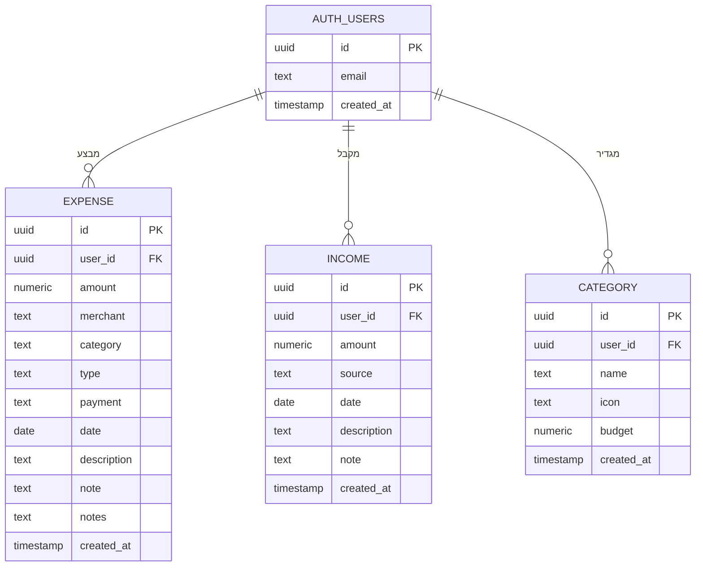

# ERD — TrackIt Expense App

## דיאגרמת ישויות וקשרים

## טבלאות

| טבלה       | Schema | תיאור                                      |
| ---------- | ------ | ------------------------------------------ |
| auth.users | auth   | משתמש — מנוהל ע"י Supabase Auth            |
| expenses   | public | הוצאה — סכום, קטגוריה, תאריך, אמצעי תשלום  |
| income     | public | הכנסה — מקור, סכום, תאריך                  |
| categories | public | קטגוריה — שם, אייקון, יעד תקציבי           |

## קשרים

- משתמש אחד → הוצאות רבות (One-to-Many)
- משתמש אחד → הכנסות רבות (One-to-Many)
- משתמש אחד → קטגוריות רבות (One-to-Many)

## הערות מימוש

- Auth מנוהל ע"י Supabase Auth (`auth.users`) — אין טבלת משתמשים ב-public schema
- כל טבלה מוגנת עם Row Level Security (RLS) — משתמש רואה רק את הנתונים שלו
- ה-FK של `user_id` מצביע ל-`auth.users.id`
- הנתונים נשמרים ב-PostgreSQL דרך Supabase
