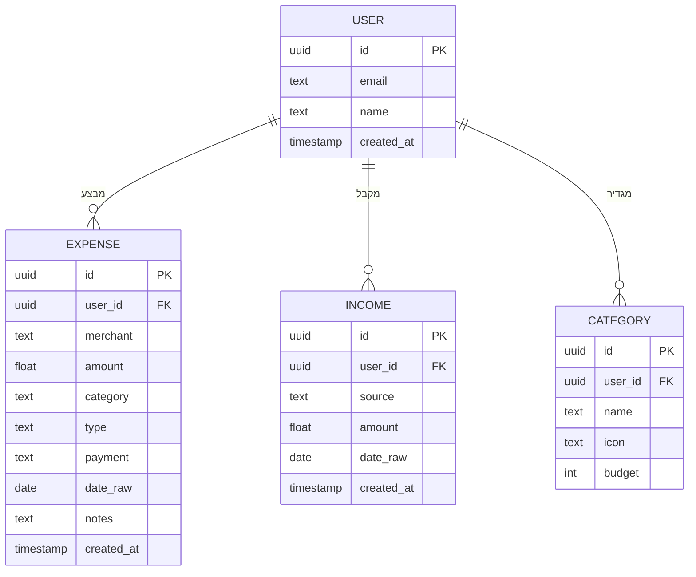

# ERD — TrackIt Expense App

## דיאגרמת ישויות וקשרים

## טבלאות

| טבלה     | תיאור                                     |
| -------- | ----------------------------------------- |
| USER     | משתמש — מייל, שם, תאריך הצטרפות           |
| EXPENSE  | הוצאה — סכום, קטגוריה, תאריך, אמצעי תשלום |
| INCOME   | הכנסה — מקור, סכום, תאריך                 |
| CATEGORY | קטגוריה — שם, אייקון, יעד תקציבי          |

## קשרים

- משתמש אחד → הוצאות רבות (One-to-Many)
- משתמש אחד → הכנסות רבות (One-to-Many)
- משתמש אחד → קטגוריות רבות (One-to-Many)
