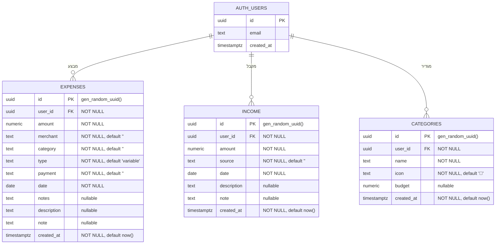

# ERD — TrackIt Expense App

## דיאגרמת ישויות וקשרים

---

## פירוט טבלאות

### `public.expenses`

| עמודה | טיפוס | nullable | ברירת מחדל | תיאור |
|---|---|---|---|---|
| `id` | uuid | NO | `gen_random_uuid()` | מפתח ראשי |
| `user_id` | uuid | NO | — | FK → `auth.users.id` |
| `amount` | numeric | NO | — | סכום ההוצאה |
| `merchant` | text | NO | `''` | שם העסק |
| `category` | text | NO | `''` | קטגוריה |
| `type` | text | NO | `'variable'` | קבועה / משתנה |
| `payment` | text | NO | `''` | אמצעי תשלום |
| `date` | date | NO | — | תאריך ההוצאה |
| `notes` | text | YES | — | הערות (בשימוש ב-UI) |
| `description` | text | YES | `''` | תיאור חופשי |
| `note` | text | YES | — | הערה קצרה |
| `created_at` | timestamptz | NO | `now()` | חותמת זמן יצירה |

---

### `public.income`

| עמודה | טיפוס | nullable | ברירת מחדל | תיאור |
|---|---|---|---|---|
| `id` | uuid | NO | `gen_random_uuid()` | מפתח ראשי |
| `user_id` | uuid | NO | — | FK → `auth.users.id` |
| `amount` | numeric | NO | — | סכום ההכנסה |
| `source` | text | NO | `''` | מקור ההכנסה |
| `date` | date | NO | — | תאריך ההכנסה |
| `description` | text | YES | `''` | תיאור חופשי |
| `note` | text | YES | — | הערה קצרה |
| `created_at` | timestamptz | NO | `now()` | חותמת זמן יצירה |

---

### `public.categories`

| עמודה | טיפוס | nullable | ברירת מחדל | תיאור |
|---|---|---|---|---|
| `id` | uuid | NO | `gen_random_uuid()` | מפתח ראשי |
| `user_id` | uuid | NO | — | FK → `auth.users.id` |
| `name` | text | NO | — | שם הקטגוריה |
| `icon` | text | NO | `'📌'` | אמוג'י לייצוג |
| `budget` | numeric | YES | — | יעד תקציב חודשי |
| `created_at` | timestamptz | NO | `now()` | חותמת זמן יצירה |

---

## Foreign Key Constraints

| שם ה-constraint | מקור | יעד |
|---|---|---|
| `expenses_user_id_fkey` | `public.expenses.user_id` | `auth.users.id` |
| `income_user_id_fkey` | `public.income.user_id` | `auth.users.id` |
| `categories_user_id_fkey` | `public.categories.user_id` | `auth.users.id` |

---

## Row Level Security (RLS)

כל שלוש הטבלאות בעלות **RLS מופעל**. לכל טבלה מוגדרות 4 policies:

| Policy | פעולה | תנאי |
|---|---|---|
| `Users see own *` | SELECT | `auth.uid() = user_id` |
| `Users insert own *` | INSERT | `auth.uid() = user_id` (with_check) |
| `Users update own *` | UPDATE | `auth.uid() = user_id` |
| `Users delete own *` | DELETE | `auth.uid() = user_id` |

**משמעות:** כל משתמש יכול לבצע CRUD אך ורק על הרשומות שלו — ה-DB אוכף את האבטחה ברמת השרת, ללא תלות ב-logic צד-לקוח.

---

## טבלאות לפי Schema

| טבלה | Schema | RLS | שורות (נוכחי) |
|---|---|---|---|
| `auth.users` | auth | מנוהל ע"י Supabase | — |
| `expenses` | public | ✅ מופעל (4 policies) | 2 |
| `income` | public | ✅ מופעל (4 policies) | 1 |
| `categories` | public | ✅ מופעל (4 policies) | 0 |

---

## קשרים

- `AUTH_USERS` **||--o{** `EXPENSES` — משתמש אחד → הוצאות רבות (One-to-Many)
- `AUTH_USERS` **||--o{** `INCOME` — משתמש אחד → הכנסות רבות (One-to-Many)
- `AUTH_USERS` **||--o{** `CATEGORIES` — משתמש אחד → קטגוריות רבות (One-to-Many)

---

## הערות מימוש

- Auth מנוהל ע"י **Supabase Auth** (`auth.users`) — אין טבלת משתמשים ב-public schema
- כל FK מצביע ל-`auth.users.id` עם `ON DELETE CASCADE` (ברמת Supabase)
- `user_id` מתמלא אוטומטית בקוד לפני כל INSERT דרך `supabase.auth.getSession()`
- הנתונים נשמרים ב-**PostgreSQL** דרך Supabase (region: ap-southeast-2)
