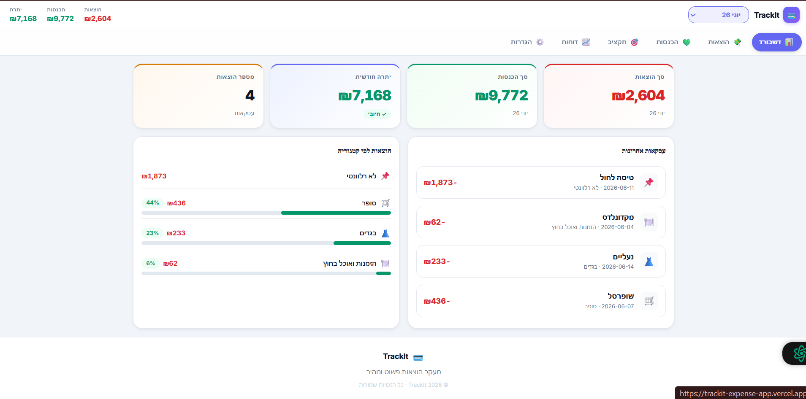

# TrackIt — אפליקציית מעקב הוצאות

## סקירה כללית

TrackIt היא אפליקציה לניהול הוצאות חודשיות לאנשים וזוגות בישראל.

**הבעיה:** אנשים לא יודעים לאן הכסף הולך בסוף החודש.  
**הפתרון:** רישום מהיר של הוצאות, סיכום חודשי חכם, מעקב תקציב לפי קטגוריות.

## קהל יעד

צעירים בגיל 20–35 שמנהלים תקציב אישי או זוגי בישראל.

## קישורים

- 🌐 **אתר חי:** https://trackit-expense-app.vercel.app
- 💻 **קוד:** https://github.com/Shiramoss/trackit-expense-app

## תצוגה מקדימה



## מתחרים ובידול

| מתחרה         | חוזקה                  | מה חסר                            |
| ------------- | ---------------------- | --------------------------------- |
| Spendee       | עיצוב נקי, גרפים       | אנגלית בלבד, לא מחובר לבנק ישראלי |
| Google Sheets | גמיש, מוכר             | ידני לגמרי, לא מותאם לטלפון       |
| **TrackIt**   | עברית, פשוט, מהיר, RTL | —                                 |

## שירותים חיצוניים

| שירות                  | סוג          | למה משמש                         |
| ---------------------- | ------------ | -------------------------------- |
| Vite                   | כלי בנייה    | הרצת פרויקט React בסביבת פיתוח   |
| React Router DOM       | ספריית ניווט | מעבר בין עמודים ללא טעינה מחדש   |
| Vercel                 | פריסה        | אחסון והגשת האפליקציה לאינטרנט   |
| Google Fonts (Inter)   | קריאת API    | טעינת פונט מהרשת                 |
| localStorage (Web API) | אחסון מקומי  | שמירת נתוני משתמש בדפדפן ללא שרת |

## מבנה הפרויקט

```
trackit/
├── DESIGN.md               ← מערכת עיצוב
├── ERD.md                  ← דיאגרמת נתונים
├── index.html
├── package.json
└── src/
    ├── main.jsx
    ├── App.jsx             ← Routing ראשי + State מרכזי
    ├── styles/
    │   └── globals.css     ← CSS Variables
    ├── data/
    │   └── dummyData.js    ← קטגוריות ברירת מחדל
    ├── components/
    │   ├── Navbar/
    │   ├── Footer/
    │   └── Layout/
    └── pages/
        ├── DashboardPage.jsx   /
        ├── ExpensesPage.jsx    /expenses
        ├── IncomePage.jsx      /income
        ├── BudgetPage.jsx      /budget
        ├── ReportsPage.jsx     /reports
        └── SettingsPage.jsx    /settings
```

## עמודים ו-URL

| עמוד   | URL         | תיאור                           |
| ------ | ----------- | ------------------------------- |
| דשבורד | `/`         | סיכום חודשי, KPIs, גרף קטגוריות |
| הוצאות | `/expenses` | רשימה, הוספה, סינון, מחיקה      |
| הכנסות | `/income`   | מקורות הכנסה, הוספה             |
| תקציב  | `/budget`   | מעקב יעדים לפי קטגוריה          |
| דוחות  | `/reports`  | גרף שנתי, השוואה חודשית         |
| הגדרות | `/settings` | ניהול קטגוריות, העדפות          |

## בדיקת האפליקציה

האפליקציה מתחילה ריקה — ניתן להוסיף הוצאות והכנסות דרך הממשק.  
**אין מערכת התחברות בגרסה זו** — הנתונים נשמרים אוטומטית בדפדפן (localStorage) ומשויכים למכשיר בלבד.  
ניתן לעבור בין חודשים דרך התפריט בחלק העליון של המסך.  
בגרסה הבאה: אימות משתמשים דרך Supabase Auth והגנה על עמודים.

## הרצת הפרויקט

```bash
npm install
npm run dev
```

## טכנולוגיות

- **React 18** + **Vite 5**
- **React Router DOM v6**
- **CSS Variables** — מערכת עיצוב מ-`globals.css`
- **localStorage** — שמירת נתונים בין רענונים
- עיצוב **RTL עברי**, רספונסיבי מ-`375px`

## Vibe Coding — איך בנינו את זה

האפליקציה נבנתה בעזרת Claude (Anthropic) כ-AI Coding Assistant.  
תהליך העבודה: תיאור דרישות בעברית ← Claude מייצר קוד ← בדיקה ידנית ← שיפור חוזר.  
כל קובץ נבדק ידנית והותאם לצרכי הפרויקט.
